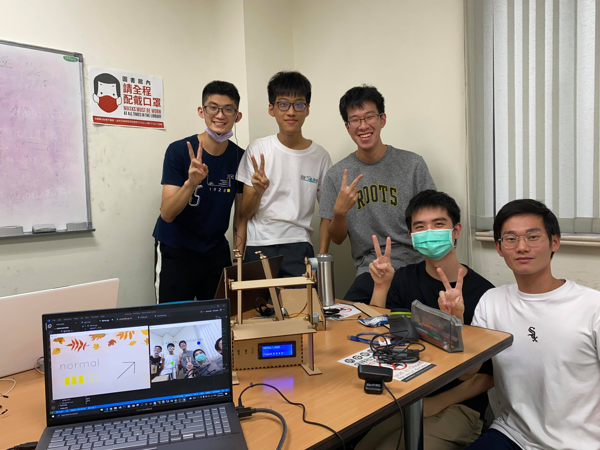
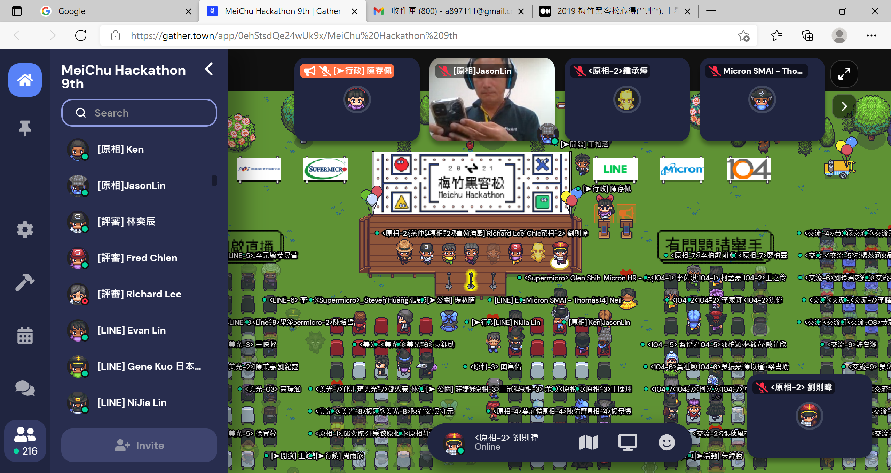

# hackthon

## QUICK START

- using python3.9

- pip install -r requirements.txt

- connect blueteeth(without using blueteeth, please use beta version)

- run src/demo.py

## Team

- Project in 2021 Mei Chu Hackathon
- five students, currently NTUEE Sophomore

## Porject

- E-Air 智慧調節系統

- 利用 mediapipe 的 pose, object detection 抓取骨架後，判斷人目前的行為模式，並客製化調整環境

- 利用 pyserial 操控 arduino 板，除了以 LCD 板顯示資訊外，更以馬達模擬扇葉轉動

- 在 Relax mode 中，設計先升後降的風量變化；在 gym mode 中，追蹤人體並改變風向；並在 night mode 中，加入偵測踢被以防著涼。

## Result

- relax & gym mode

- night mode

## PRIZES

- 2021 梅竹黑克松梅竹大獎

- 2021 梅竹黑克松原相組第一名

# Reference

- [mediapipe](https://mediapipe.dev/)

## Files in dump

- Test certain pose detection and count times.
- Too slow for real time demo.
